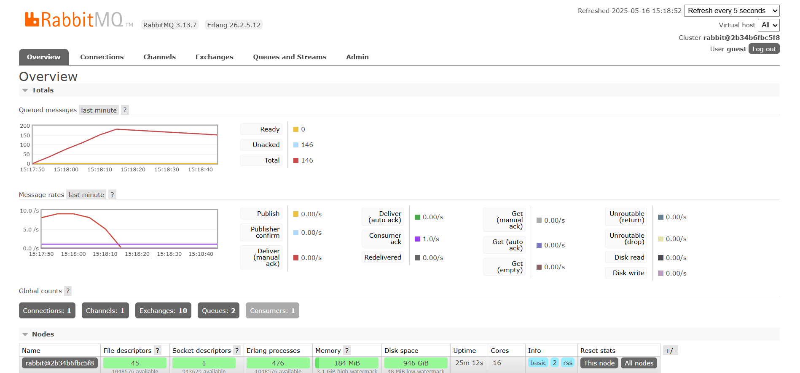

1. What is amqp?
- Advanced Message Queueing Protocol adalah protokol untuk middleware berbasis message. AMQP dapat membuat aplikasi berkomunikasi dengan satu sama lain dengan adanya mesasge broker, misal RabbitMQ yang digunakan pada tutorial ini. 

2. guest:guest@localhost:5672
- guest pertama adalah username
- guest kedua adalah password 
- localhost adalah nama host yang menjalankan broker, pada saat ini ada di mesin lokal. 
- 5672 adalah port di mana RabbitMQ mendeteksi koneksi AMQP. 

3. Simulasi slow subscriber 
- 0 Ready -> 0 message masih menunggu di queue 
- 141 Unacked -> 141 message sudah dikirim ke subscriber, tetapi belun diacknowledged oleh subscriber. 
- Maka, total adalah 0 + 141 = 141. 
