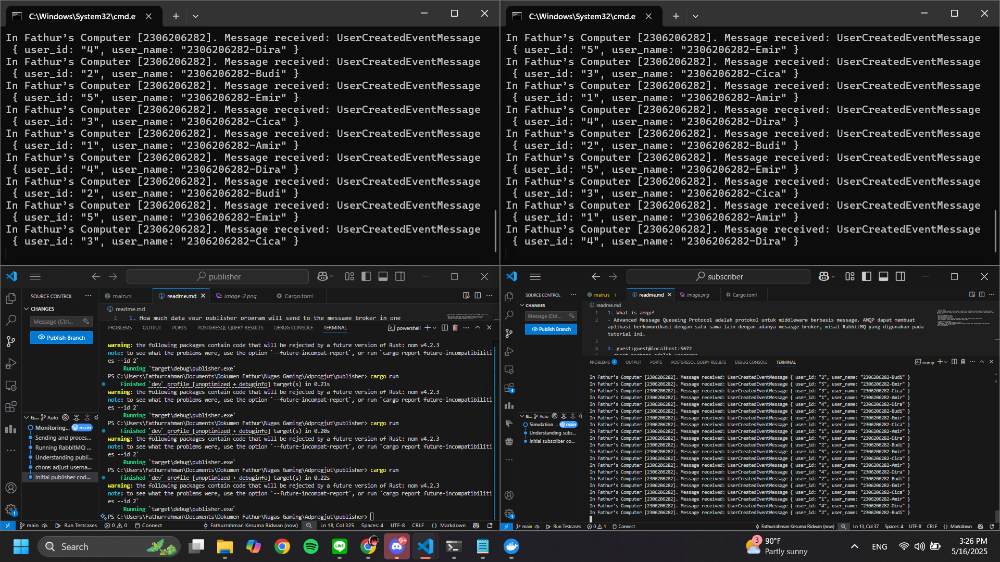
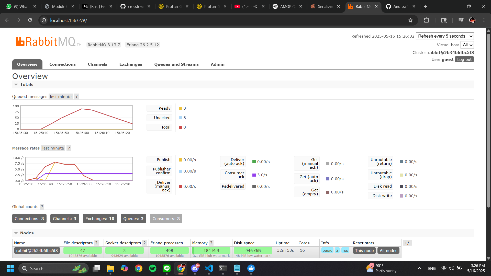

1. What is amqp?
- Advanced Message Queueing Protocol adalah protokol untuk middleware berbasis message. AMQP dapat membuat aplikasi berkomunikasi dengan satu sama lain dengan adanya mesasge broker, misal RabbitMQ yang digunakan pada tutorial ini. 

2. guest:guest@localhost:5672
- guest pertama adalah username
- guest kedua adalah password 
- localhost adalah nama host yang menjalankan broker, pada saat ini ada di mesin lokal. 
- 5672 adalah port di mana RabbitMQ mendeteksi koneksi AMQP. 

3. Simulasi slow subscriber 
- 0 Ready -> 0 message masih menunggu di queue 
- 141 Unacked -> 141 message sudah dikirim ke subscriber, tetapi belun diacknowledged oleh subscriber. 
- Maka, total adalah 0 + 141 = 141. 

4. Multiple subscriber 
-Message queue dapat berkurang dengan cepat dan message dapat diacknowledge lebih cepat dengan banyak subscriber dibandingkan satu subscriber karena message dapat diproses secara paralel. 

5. Reflection
- Improvements:
    - Tidak ignore result dengan _ pada publisher, gunakan expect atau return result sebagai pengganti. 
    - Gunakan logging yang proper daripada println.
    - fix infinite loop{} dengan shutdown handling yang lebih proper. 